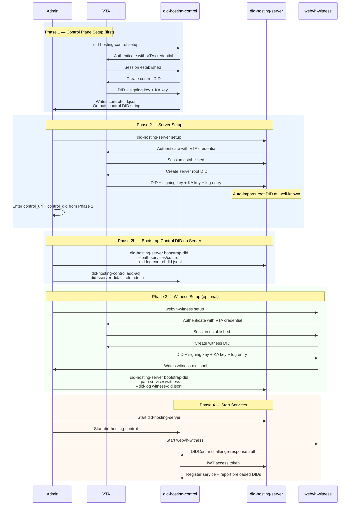

# Bootstrap & Startup Guide

This document explains how to set up a complete WebVH environment with DIDComm-based authentication between services.

## Prerequisites

- VTA (Verifiable Trust Agent) credentials for each service's context
  - Each service gets its own isolated VTA context
  - Credentials are base64url-encoded strings issued by the VTA operator
- Compiled WebVH binaries: `did-hosting-server`, `did-hosting-control`, `webvh-witness`
- A public URL where the server will serve DIDs (e.g., `https://did.example.com`)

## Architecture Overview

Services authenticate with each other using DIDComm challenge-response:

- **did-hosting-control** — manages service registration, ACLs, and DID sync (set up first)
- **did-hosting-server** — hosts DID documents at public URLs (set up second)
- **webvh-witness** — provides witness proofs for DID log entries (optional, set up last)

Each service connects to its own VTA context during setup, creates its own DID, retrieves keys, and stores them locally. No external PNM CLI is needed.

## Sequence Diagram



## Step-by-Step Setup

### Phase 1: Control Plane (set up first — other services need its DID)

```bash
did-hosting-control setup
```

The wizard prompts for:
1. **VTA credential** — base64url string for the control plane's VTA context
2. **DID hosting URL** — where did-hosting-server will serve DIDs (e.g., `https://did.example.com`)
3. **DID path** — path on the server (default: `services/control`)
4. **Public URL** — control plane's own URL for WebAuthn (e.g., `http://localhost:8532`)
5. Host, port, log level, data directory, secrets backend
6. **Admin ACL** — enter an existing DID or generate a new `did:key`

Output:
- `config.toml` — control plane configuration
- `control-did.jsonl` — DID log entry to import on the server
- Control DID string (displayed on screen)

**Save the control DID** — you'll need it when setting up the server.

### Phase 2: Server (set up second — hosts all DIDs)

```bash
did-hosting-server setup
```

The wizard prompts for:
1. **VTA credential** — base64url string for the server's VTA context
2. **Public URL** — where DIDs are served (e.g., `https://did.example.com`)
3. Features (DIDComm, REST API)
4. **Control plane URL** — e.g., `http://localhost:8532` (from Phase 1)
5. **Control plane DID** — paste the DID from Phase 1
6. Host, port, log level, data directory, secrets backend
7. **Admin ACL** — enter an existing DID or generate a new `did:key`

The wizard automatically creates the root DID and imports it at `.well-known`.

### Phase 2b: Bootstrap Control DID on Server

Import the control plane's DID log entry onto the server:

```bash
did-hosting-server bootstrap-did \
  --path services/control \
  --did-log control-did.jsonl
```

Grant the server admin access to the control plane:

```bash
did-hosting-control add-acl --did <server-DID> --role admin
```

Replace `<server-DID>` with the DID printed during server setup.

### Phase 3: Witness (optional — set up after server)

```bash
webvh-witness setup
```

The wizard prompts for:
1. **VTA credential** — base64url string for the witness's VTA context
2. **DID hosting URL** — the server's public URL
3. **DID path** — path on the server (default: `services/witness`)
4. Features, host, port, log level, data directory, secrets backend
5. **Admin ACL**

Import the witness DID on the server:

```bash
did-hosting-server bootstrap-did \
  --path services/witness \
  --did-log witness-did.jsonl
```

### Phase 4: Start Services

```bash
# Terminal 1
did-hosting-server --config config.toml

# Terminal 2
did-hosting-control --config config.toml

# Terminal 3 (if witness is configured)
webvh-witness --config config.toml
```

On startup, the server will:
1. Authenticate with the control plane via DIDComm challenge-response
2. Register itself, reporting all preloaded DIDs
3. Apply any DID updates received from the control plane

## Daemon Mode (All-in-One)

For development or simple deployments, use `did-hosting-daemon` which runs all services in a single process:

```toml
# daemon-config.toml
server_did = "did:webvh:..."
public_url = "https://did.example.com"
did_hosting_url = "https://did.example.com"

[server]
host = "0.0.0.0"
port = 8534

[enable]
server = true
control = true
witness = true
watcher = false
```

```bash
did-hosting-daemon --config daemon-config.toml
```

In daemon mode, inter-service communication happens in-process without network calls.

## Self-Managed Mode (no VTA — daemon only)

For deployments that don't have a parent VTA bootstrapping the daemon's own identity — internal-only deployments, dev/test environments, or operators who want to be their own trust root — the daemon can self-manage its keys and DID.

### What "self-managed" means

| | VTA mode (default) | Self-managed mode |
|---|---|---|
| Daemon's signing + KA keys | Provisioned by parent VTA at setup | Generated locally at setup |
| Daemon's own DID | Minted by parent VTA | Locally-built `did:webvh`, hosted by the daemon at its own well-known URL |
| `vta_credential` in secrets | Set, used for re-auth | Permanently `None` |
| `[vta]` config table | Required (`url`, `did`, `context_id`) | Empty / omitted |
| Tenant DID provisioning | External tenant VTAs DIDComm in to provision tenant DIDs | **Identical** — external tenant VTAs can still DIDComm in. Self-managed only changes how the daemon obtains *its own* identity, not how it serves tenants. |

**Daemon-only.** `did-hosting-server`, `did-hosting-control`, `webvh-witness` standalone binaries reject the self-managed setup choice with a clear error in v1. If you want a no-VTA deployment, run `did-hosting-daemon`.

**No migration path.** A self-managed daemon cannot be migrated onto a VTA later; the mode is permanent at setup time. (If you need to switch, start a fresh deployment.)

### Setup walkthrough

```bash
did-hosting-daemon setup
```

When the wizard asks _"How will the daemon obtain its identity?"_, choose:

```
> Self-managed (no VTA — daemon manages its own DID)
```

The wizard then prompts for the same daemon settings as VTA mode (public URL, mediator, host/port, log, data dir, secrets backend) but skips every VTA-specific prompt (no VTA DID, no context ID, no PNM `contexts create` step). Keys are generated locally; the daemon's `did:webvh` is built and imported into the local store; the config is written with `[identity] mode = "self-managed"` and an empty `[vta]` table.

A loud warning fires if the public URL is `http://` or points at `localhost` / `127.0.0.1` / `::1`. The wizard accepts these (useful for dev) but the warning makes it hard to ship one of these into production by accident.

### After setup: enrolling an admin

The wizard does **not** seed an admin DID into the ACL. Self-managed mode uses passkey-invite-only admin authentication:

```bash
# 1. Start the daemon
did-hosting-daemon --config config.toml

# 2. In another terminal, mint your first admin enrolment URL.
#    <ADMIN_DID> is the DID the admin will authenticate as
#    (typically a did:key from a wallet you control).
did-hosting-daemon invite --did <ADMIN_DID> --role admin --config config.toml

# 3. Open the printed enrolment URL in a browser and bind a passkey.
#    Subsequent admin login uses the passkey.
```

The `invite` subcommand is the single source of truth for admin onboarding — re-run it any time the operator needs another admin. Lost the URL before redeeming? Just run `did-hosting-daemon invite` again to mint a new one.

### Config shape

A self-managed `config.toml` looks like:

```toml
public_url = "https://daemon.example.com"
did_hosting_url = "https://daemon.example.com"
server_did = "did:webvh:<scid>:daemon.example.com"
# mediator_did = "did:webvh:..."  # optional — for inbound DIDComm

[identity]
mode = "self-managed"

[vta]
# empty — no parent VTA

[server]
host = "0.0.0.0"
port = 8534

[enable]
server = true
control = true
witness = true
watcher = false

# ... [auth], [log], [store], [witness_store], [secrets], [features], etc.
```

Existing VTA-mode configs without an `[identity]` block continue to load unchanged — the loader defaults `identity.mode = "vta"` for back-compat.

See `docs/self-managed-mode-spec.md` for the full design spec, `tasks/runtime-audit-T3.md` for the runtime VTA-dependency audit, and `tasks/plan.md` for the implementation breakdown.

## Non-Interactive Setup (Recipe-Driven)

For CI / scripted deployments, every `setup` subcommand accepts a
**recipe TOML** that captures the answers the interactive wizard would
prompt for. The recipe contains no secrets — keys are generated by
setup, cloud credentials come from the environment.

```bash
# Run setup with no prompts. For online VTA mode, phase 1 still mints
# the ephemeral did:key separately; the recipe drives phase 2.
did-hosting-server setup --setup-key-out setup.key --context webvh
# (operator enrols the printed did:key at the VTA)
did-hosting-server setup --from examples/did-hosting-server-build.toml \
                   --setup-key-file setup.key
```

For VTA-less deployments the daemon supports `vta_mode = "self-managed"`:

```bash
# No phase-1 / phase-2; the daemon generates its own keys.
did-hosting-daemon setup --from examples/did-hosting-daemon-build.toml
```

For fully **air-gapped** deployments — where the CI runner has no VTA
network access at all — both phases of the sealed-bundle flow run
non-interactively from the same recipe file:

```bash
# Phase 1: write a sealed bootstrap request. Persists the ephemeral
# seed to the configured secret backend. Exits.
did-hosting-server setup --from recipe.toml
#   ▶ recipe.toml has  [deployment].vta_mode = "offline-prepare"
#                      [vta].request_path    = "bootstrap-request.json"

# Operator ferries bootstrap-request.json to the VTA admin, receives
# bundle.armor + SHA-256 digest back out-of-band.

# Phase 2: same recipe, switched to offline-complete + bundle fields.
# The seed comes back out of the same secret backend automatically.
did-hosting-server setup --from recipe.toml
#   ▶ recipe.toml now has  [deployment].vta_mode = "offline-complete"
#                          [vta].bundle_path     = "bundle.armor"
#                          [vta].expect_digest   = "<hex-sha256>"
```

The recipe is the only state file — no separate state TOML is needed.
The same secret backend keys both phases; if you rotate `[secrets]`
between calls phase 2 cannot find the seed and exits with an error.

Recipes are shipped under `examples/`:

| Recipe | Drives |
|---|---|
| `did-hosting-daemon-build.toml`  | `did-hosting-daemon setup --from` |
| `did-hosting-server-build.toml`  | `did-hosting-server setup --from` |
| `did-hosting-control-build.toml` | `did-hosting-control setup --from` |
| `webvh-witness-build.toml` | `webvh-witness setup --from` |
| `webvh-watcher-build.toml` | `webvh-watcher setup --from` |

### CLI flags added to each binary's `setup`

| Flag | Effect |
|---|---|
| `--from <path>` | Drive setup from a recipe TOML; skip every prompt. |
| `--force-reprovision` | Allow overwriting an existing install (backs up `config.toml` to `config.toml.bak` first). |
| `--non-interactive` | Requires `--from`. Fail fast if a required field is missing rather than silently dropping into a prompt that would hang in CI. |

### Reprovision safety

Before any non-interactive run rotates credentials, the wizard probes
the configured secret backend. If a live `ServerSecrets` entry is
present it refuses (exit code 4) unless `--force-reprovision` or
`[reprovision].force = true` is set. Rotating silently would invalidate
JWTs and break the active VTA session.

### Uninstall

`webvh-{daemon,server,control,witness} uninstall` lists the managed
secret-store entries + companion files, prompts for a typed `DELETE`
confirmation, and removes them. Pass `--yes` in CI to skip the prompt.
DIDs in the local store and the data directory are NOT removed; delete
those manually if you want a clean slate.

### Exit codes

| Code | Meaning |
|---|---|
| 0 | Success |
| 2 | VTA: no transport worked (every advertised pre-auth path failed) |
| 3 | VTA: post-auth request body rejected |
| 4 | Reprovision refused (existing install detected; pass `--force-reprovision` to rotate) |
| 5 | Recipe parse/validation failed |
| 1 | Anything else |

### Environment-variable overlay

Recipe fields can be overridden at load time via the runtime env vars
documented under [Environment Variables](#environment-variables). The
recipe value loses to the env var so one recipe can be templated
across dev / staging / prod by setting `DAEMON_PUBLIC_URL` etc. per
environment.

## Cold-Start Bootstrap (No Running Services)

Bootstraps a complete environment from scratch — no DID resolution, no DIDComm, no running services. All DIDs are created offline on the VTA and loaded manually.

### Prerequisites

- Compiled binaries: `vta`, `did-hosting-server`, `mediator-setup-vta`, `mediator`
- A minimal `config.toml` for the did-hosting-server (`public_url`, `[server]`, `[store]`, `[secrets]`)
- A `mediator.toml` for the mediator (use the template in `conf/mediator.toml`)
- Redis running (required by the mediator)

### Step 1: VTA Setup (offline)

```bash
vta setup
```

Creates the master seed, VTA DID, and local data store. When prompted, choose to create the VTA DID in serverless mode. Save the `did-vta.jsonl` and note the VTA credential.

### Step 2: Create DIDs on the VTA (offline)

```bash
vta create-did-webvh --context ctx1 --label server
vta create-did-webvh --context mediator --label mediator
```

Each command prompts for a WebVH URL, creates the DID locally (serverless mode), and saves a `did.jsonl` file. When prompted, **export the secrets bundle** for each — copy the base64url output.

You should now have:
- `did-vta.jsonl` + VTA credential (from step 1)
- `did-server.jsonl` + server secrets bundle (from step 2)
- `did-mediator.jsonl` + mediator secrets bundle (from step 2)

### Step 3: Set up the WebVH Server (offline)

```bash
# Import the server's keys
did-hosting-server import-secrets --config config.toml \
  --vta-bundle <server-secrets-bundle>

# Load all three DIDs
did-hosting-server load-did --path .well-known --did-log did-server.jsonl
did-hosting-server load-did --path <vta-path> --did-log did-vta.jsonl
did-hosting-server load-did --path <mediator-path> --did-log did-mediator.jsonl
```

### Step 4: Start the WebVH Server

```bash
did-hosting-server --config config.toml
```

All three DIDs are now resolvable via HTTP.

### Step 5: Set up the Mediator (offline)

```bash
mediator-setup-vta --import-bundle --config conf/mediator.toml
```

When prompted:
1. Paste the **mediator secrets bundle**
2. Paste the **VTA credential**
3. Choose a storage backend (string/AWS/keyring)
4. Provide `did-mediator.jsonl` path — enables the mediator to resolve its own DID locally, so it can restart independently of the did-hosting-server
5. Enter the VTA context ID (e.g., `mediator`)

### Step 6: Start the Mediator

```bash
mediator
```

Falls back to cached secrets (VTA not yet running). Resolves its own DID from the local document.

### Step 7: Start the VTA

```bash
vta --config config.toml
```

All services can now resolve each other. DIDComm is fully operational.

### Post-Bootstrap

After all services are running:

- **Register the did-hosting-server with the VTA** (required for creating new DIDs via VTA):
  ```bash
  vta webvh add-server --id <server-id> --did <server-did>
  ```
- **Change the mediator JWT key** for production — update `jwt_authorization_secret` in `mediator.toml`
- **Optional:** Pass `--vta-credential` to `did-hosting-server import-secrets` if you want the server to refresh keys from the VTA automatically on restart

### Restart Behavior

All services restart cleanly during normal operations:

- **WebVH server** — loads DIDs from persistent store, re-registers with control plane in background
- **Mediator** — fetches fresh secrets from VTA if available, falls back to cache if VTA is down. Resolves own DID from local document (no did-hosting-server dependency)
- **VTA** — DIDComm retries mediator connection with backoff. REST API works immediately

### Cold-Start Summary

| Step | Action | Network? | Services Running |
|------|--------|----------|------------------|
| 1 | `vta setup` | No | None |
| 2 | `vta create-did-webvh` (×2) | No | None |
| 3 | `did-hosting-server import-secrets` + `load-did` (×3) | No | None |
| 4 | Start did-hosting-server | No | WebVH |
| 5 | `mediator-setup-vta --import-bundle` | No | WebVH |
| 6 | Start mediator | Yes (DID resolution) | WebVH, Mediator |
| 7 | Start VTA | Yes (DID resolution) | All |

## Verifying the Setup

### Check server health
```bash
curl http://localhost:8530/api/health
```

### Check DID resolution
```bash
curl http://localhost:8530/.well-known/did.jsonl
curl http://localhost:8530/services/control/did.jsonl
```

### Check control plane registry
```bash
# Requires admin auth token
curl -H "Authorization: Bearer <token>" \
  http://localhost:8532/api/control/registry
```

### Check ACL entries
```bash
did-hosting-server list-acl
did-hosting-control list-acl
```

## Environment Variables

### did-hosting-server
| Variable | Description |
|----------|-------------|
| `DID_HOSTING_SERVER_DID` | Server's DID |
| `DID_HOSTING_PUBLIC_URL` | Public-facing URL |
| `DID_HOSTING_CONTROL_URL` | Control plane URL |
| `DID_HOSTING_CONTROL_DID` | Control plane's DID |
| `DID_HOSTING_VTA_URL` | VTA REST URL |
| `DID_HOSTING_VTA_DID` | VTA DID for DIDComm |
| `DID_HOSTING_VTA_CONTEXT_ID` | VTA context ID |

### did-hosting-control
| Variable | Description |
|----------|-------------|
| `CONTROL_SERVER_DID` | Control plane's DID |
| `CONTROL_PUBLIC_URL` | Public-facing URL |
| `CONTROL_DID_HOSTING_URL` | DID hosting URL (where DIDs are publicly served) |
| `CONTROL_VTA_URL` | VTA REST URL |
| `CONTROL_VTA_DID` | VTA DID for DIDComm |
| `CONTROL_VTA_CONTEXT_ID` | VTA context ID |

### webvh-witness
| Variable | Description |
|----------|-------------|
| `WITNESS_SERVER_DID` | Witness's DID |
| `WITNESS_VTA_URL` | VTA REST URL |
| `WITNESS_VTA_DID` | VTA DID for DIDComm |
| `WITNESS_VTA_CONTEXT_ID` | VTA context ID |

### Cloud secret backends (all binaries)

The same env-var prefix that scopes `DID_HOSTING_*` / `CONTROL_*` / `WITNESS_*`
also scopes the cloud secret backends. Replace `<PREFIX>` below with
`WEBVH`, `CONTROL`, `WITNESS`, or `DAEMON`.

| Variable | Description |
|----------|-------------|
| `<PREFIX>_SECRETS_KEYRING_SERVICE` | OS keyring service name (default backend) |
| `<PREFIX>_SECRETS_AWS_SECRET_NAME` | AWS Secrets Manager secret name |
| `<PREFIX>_SECRETS_AWS_REGION` | AWS region (e.g. `us-east-1`) |
| `<PREFIX>_SECRETS_GCP_PROJECT` | GCP project ID |
| `<PREFIX>_SECRETS_GCP_SECRET_NAME` | GCP Secret Manager secret name |
| `<PREFIX>_SECRETS_AZURE_VAULT_URL` | Azure Key Vault URL (e.g. `https://my-vault.vault.azure.net/`) |
| `<PREFIX>_SECRETS_AZURE_SECRET_NAME` | Azure Key Vault secret name |

Selection precedence at runtime: AWS → GCP → Azure → keyring → plaintext.
Compile-time feature gates (`aws-secrets`, `gcp-secrets`, `azure-secrets`,
`keyring`) decide which backends are even compiled in. Only compile in the
backends you'll use — they each pull a sizable cloud SDK.

### Storage backends (all binaries)

| Variable | Description |
|----------|-------------|
| `<PREFIX>_STORE_DATA_DIR` | Fjall on-disk path (default backend) |
| `<PREFIX>_STORE_REDIS_URL` | Redis connection URL |
| `<PREFIX>_STORE_DYNAMODB_TABLE` | DynamoDB table name |
| `<PREFIX>_STORE_DYNAMODB_REGION` | AWS region for DynamoDB |
| `<PREFIX>_STORE_FIRESTORE_PROJECT` | GCP project ID for Firestore |
| `<PREFIX>_STORE_FIRESTORE_DATABASE` | Firestore database id |
| `<PREFIX>_STORE_COSMOSDB_ENDPOINT` | Cosmos DB account endpoint |
| `<PREFIX>_STORE_COSMOSDB_DATABASE` | Cosmos DB database name |
| `<PREFIX>_STORE_COSMOSDB_CONTAINER` | Cosmos DB container name |
| `<PREFIX>_STORE_COSMOSDB_REGION` | Azure region (display form `"West US 2"` or normalised `"westus2"`; defaults to `eastus`) |

Storage backends are mutually exclusive — exactly one of `store-fjall`,
`store-redis`, `store-dynamodb`, `store-firestore`, `store-cosmosdb`
must be enabled at build time.
